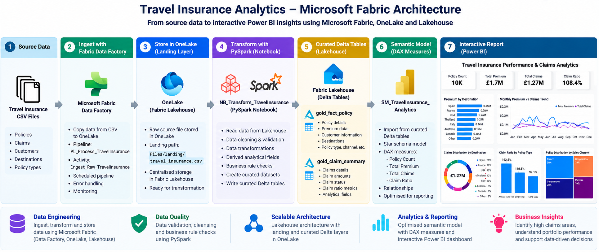
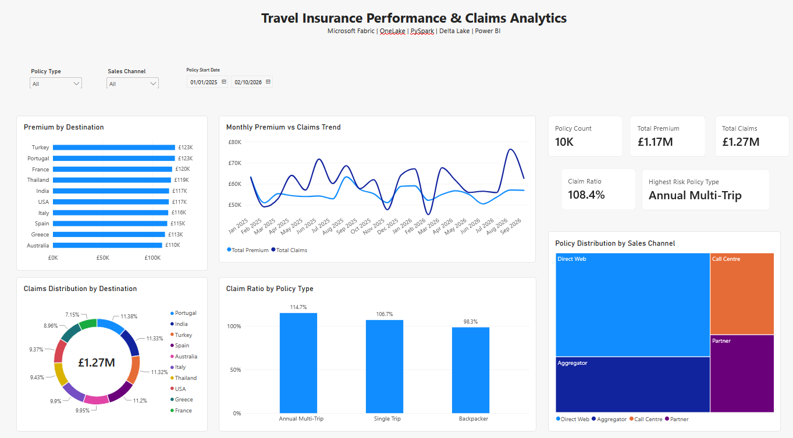
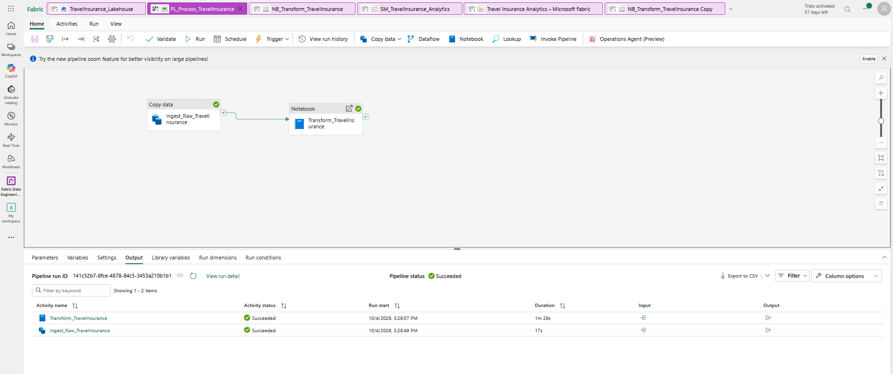

# Microsoft Fabric Travel Insurance Analytics

## Key Technologies

An end-to-end data engineering and analytics project built using **Microsoft Fabric**, demonstrating data ingestion, pipeline orchestration, Lakehouse architecture, PySpark transformation, Delta tables, semantic modelling and Power BI reporting.

## Project Overview

This project demonstrates how travel insurance policy and claims data can be processed through a modern Microsoft Fabric data engineering and analytics workflow.

A **Microsoft Fabric Data Factory pipeline** orchestrates the ingestion and transformation process. Raw travel insurance data is copied into the Fabric Lakehouse landing layer, then processed using a **PySpark notebook** to create curated Delta tables for downstream analytics.

A **semantic model** provides the business layer for an interactive Power BI report covering policy performance, premium income, claims and risk indicators.

## Solution Architecture

## Architecture

**Source Data → Fabric Data Factory Pipeline → OneLake / Lakehouse → PySpark Transformation → Delta Tables → Semantic Model → Power BI**

## Microsoft Fabric Components

- **Fabric Data Factory** – data ingestion and pipeline orchestration
- **OneLake** – centralised data storage
- **Fabric Lakehouse** – landing and curated analytical data
- **PySpark Notebook** – data transformation and data-quality processing
- **Delta Lake** – curated analytical tables
- **Semantic Model** – business measures and analytical layer
- **Power BI** – interactive reporting and visualisation

## Data Engineering Workflow

### 1. Data Ingestion

The `PL_Process_TravelInsurance` pipeline uses a **Copy Data** activity (`Ingest_Raw_TravelInsurance`) to move the source travel insurance CSV into the Lakehouse landing layer.

The landing dataset is stored in:

`Files/landing/travel_insurance.csv`

### 2. Pipeline Orchestration

The ingestion activity is connected to the `Transform_TravelInsurance` notebook activity using a success dependency.

This ensures that the transformation process starts only after the ingestion step has completed successfully.

**Pipeline flow:**

`Ingest_Raw_TravelInsurance → Transform_TravelInsurance`

### 3. PySpark Transformation

The `NB_Transform_TravelInsurance` notebook reads the landed travel insurance dataset from the Fabric Lakehouse and processes it using **PySpark**.

The transformation workflow includes:

- Schema inference and data type handling
- Data preparation and transformation
- Derived analytical fields
- Data-quality processing
- Preparation of policy and claims data for downstream analytics

### 4. Curated Delta Tables

The transformed data is written to curated **Delta tables** for analytical consumption.

Key analytical tables include:

- `gold_fact_policy`
- `gold_claim_summary`

### 5. Semantic Model

The `SM_TravelInsurance_Analytics` semantic model provides the business and analytical layer used by the Power BI report.

Key measures include:

- Policy Count
- Total Premium
- Total Claims
- Claim Ratio
- Highest Risk Policy Type

### 6. Power BI Analytics

The final **Travel Insurance Performance & Claims Analytics** report provides analysis of:

- Premium by destination
- Claims distribution by destination
- Monthly premium vs claims trends
- Claim ratio by policy type
- Policy distribution by sales channel
- Overall policy, premium and claims KPIs

Interactive slicers allow analysis by **policy type, sales channel and policy start date**.

### Power BI Report

## Business Insights

The analytical layer enables:

- Comparison of premium income against claims
- Identification of higher-risk policy types
- Analysis of destination-level performance
- Monitoring of policy distribution across sales channels
- Trend analysis of premiums and claims over time

For example, the portfolio analysis identifies **Annual Multi-Trip** as the policy type with the highest claim ratio in the sample dataset.

## Project Purpose

This portfolio project demonstrates practical implementation of an **end-to-end Microsoft Fabric data engineering and analytics solution**, covering data ingestion, pipeline orchestration, Lakehouse storage, PySpark transformation, Delta Lake, semantic modelling and business intelligence.

It also demonstrates how Microsoft Fabric can bring data engineering and analytics workloads together within a unified platform.

## Pipeline Execution

The Microsoft Fabric Data Factory pipeline successfully orchestrates the complete ingestion and transformation workflow.

Ingest_Raw_TravelInsurance first copies the source dataset into the Lakehouse landing layer. After successful ingestion, Transform_TravelInsurance executes the PySpark notebook to process the data and write the curated Delta tables.

## Author

### Satheesh Gurusamy

### Connect With Me

- LinkedIn : https://www.linkedin.com/in/satheeshgurusamy
- Web : www.sgsamy.com
- GitHub : https://github.com/SGSAMY
